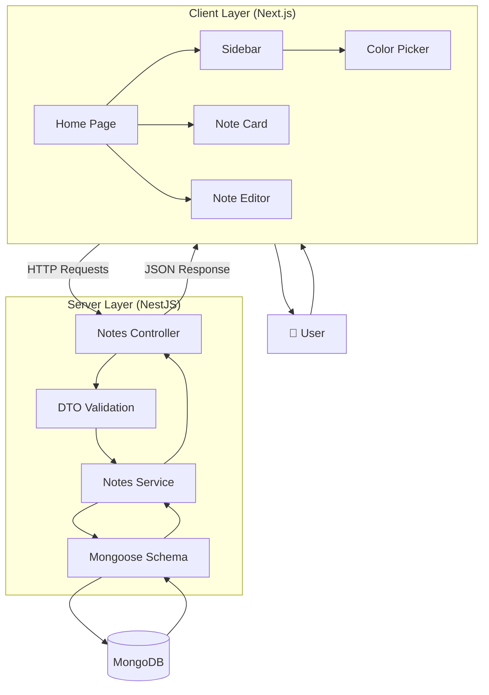
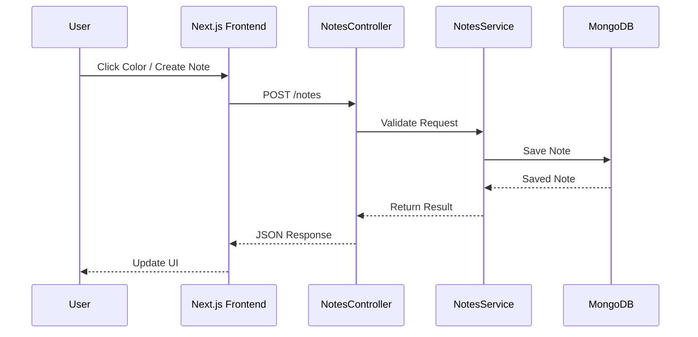
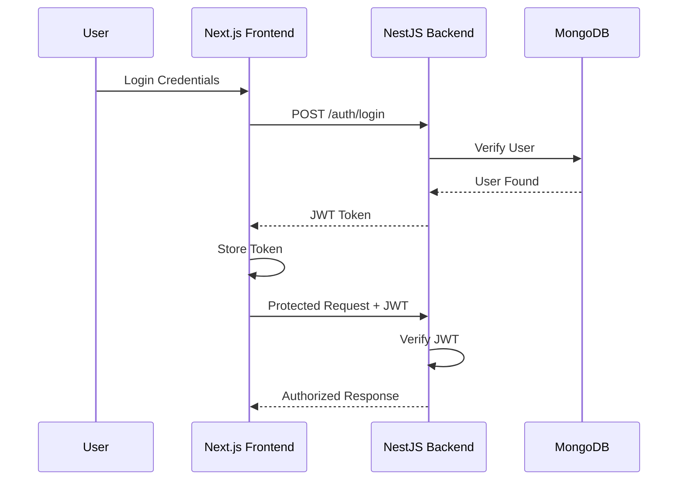

# 📝 Notes App – Full Stack Notes Management System
### 𝐂𝐚𝐬𝐞 𝐒𝐭𝐮𝐝𝐲: Modern Next.js + NestJS Notes Application


---

## 📌 Project Overview

**Name:** Smart Notes App  
**Type:** Full Stack Notes Management System  

The Notes App is a modern full-stack web application that allows users to create, edit, and delete color-coded notes in a clean and interactive user interface. Each note is stored in a database and persists across sessions, ensuring that users never lose their important information.

This project demonstrates how a real-world CRUD application is designed using a clear separation between frontend and backend systems. The application follows industry practices by organizing the code into reusable components, service layers, controllers, and database models.

---

## 🔗 GitHub Repository

GitHub Link: https://github.com/Manahil-Afzal/Notes-Diary

---

## 🎯 Goals of the Project

- Build a full-stack CRUD application from scratch.
- Understand frontend and backend integration.
- Learn how REST APIs work.
- Store and retrieve data from MongoDB.
- Create a responsive and user-friendly interface.
- Understand enterprise-level backend architecture.
- Learn how data flows through a modern application.
- Gain practical experience with scalable project structures.

---

## 🏗️ Complete System Architecture



---

## 🔄 How the Application Works

### User Interaction Flow



---

## 🔐 Security Architecture

Although the current Notes App focuses on CRUD operations, the architecture is designed to support authentication and authorization in future versions.

### Authentication Flow



---

## 🛡️ How Token-Based Security Works

### Step 1: User Login

The user enters login credentials from the frontend.

### Step 2: Verification

NestJS checks the credentials against MongoDB.

### Step 3: JWT Generation

If the credentials are valid, NestJS generates a JSON Web Token (JWT).

### Step 4: Token Storage

The frontend stores the token securely.

Common approaches include:

- HTTP-only Cookies (Recommended)
- Local Storage
- Session Storage

### Step 5: Sending Protected Requests

The frontend attaches the token with every protected request.

Example:

```http
Authorization: Bearer JWT_TOKEN
```

### Step 6: Authorization

NestJS verifies the token before granting access to protected resources.

---

## 🏛️ Layered Architecture Responsibilities

### Frontend (Next.js)

Responsible for:

- User Interface
- Rendering Notes
- State Management
- Handling User Events
- Sending API Requests
- Displaying Responses

---

### Controller Layer

Responsible for:

- Receiving Requests
- Defining API Routes
- Returning Responses
- Calling Services

Example Endpoints:

- POST `/notes`
- GET `/notes`
- DELETE `/notes/:id`

---

### DTO Layer

Responsible for:

- Request Validation
- Data Integrity
- Preventing Invalid Inputs

Example:

```typescript
CreateNoteDto
```

---

### Service Layer

Responsible for:

- Business Logic
- Data Processing
- Database Communication
- Reusable Operations

Example:

```typescript
NotesService
```

---

### Schema Layer

Responsible for:

- Defining MongoDB Structure
- Creating Mongoose Models
- Managing Documents

Example:

```typescript
NoteSchema
```

---

### Database Layer

Responsible for:

- Persistent Storage
- Data Retrieval
- Data Modification
- Data Consistency

Collection:

```text
notes
```

---

## ✨ Key Features

- Create new notes
- Color-coded notes system
- Edit note content
- Delete notes instantly
- Persistent MongoDB storage
- Responsive mobile and desktop design
- Fast UI updates without page reload
- Clean and scalable architecture

---

## 🧠 Tech Stack

### Frontend

- Next.js (React Framework)
- Tailwind CSS
- Lucide React

### Backend

- NestJS
- TypeScript
- Mongoose

### Database

- MongoDB Atlas / Local MongoDB

---

## 💡 Why We Use These Technologies

### Next.js

#### Why?

- Fast rendering
- Component-based architecture
- File-based routing
- Performance optimization
- Excellent developer experience

#### Mostly Used For

- Dashboards
- SaaS Applications
- E-commerce Platforms
- Enterprise Systems
- Content Platforms

---

### NestJS

#### Why?

- Scalable backend architecture
- TypeScript support
- Dependency Injection
- Modular design
- Enterprise standards

#### Mostly Used For

- REST APIs
- Enterprise Applications
- Microservices
- Backend Platforms

---

### MongoDB

#### Why?

- Flexible schema design
- Fast read/write operations
- Easy scalability
- Developer friendly

#### Mostly Used For

- CRUD Applications
- Real-time Systems
- Content Management Systems
- Modern Web Applications

---

## ⚙️ Setup Instructions

### Client (Frontend)

```bash
npm install
npm run dev

---

### Server (Backend)

```bash
npm install
npm run start:dev
```

---

## 🔗 API Endpoints

| Method | Endpoint | Description |
|----------|----------|-------------|
| POST | `/notes` | Create a new note |
| GET | `/notes` | Retrieve all notes |
| DELETE | `/notes/:id` | Delete a note |

---

## 👩‍💻 Author

**Manahil Afzal**

Software Engineering Student | MERN Stack Developer | Exploring Full Stack Development with Next.js and NestJS.
